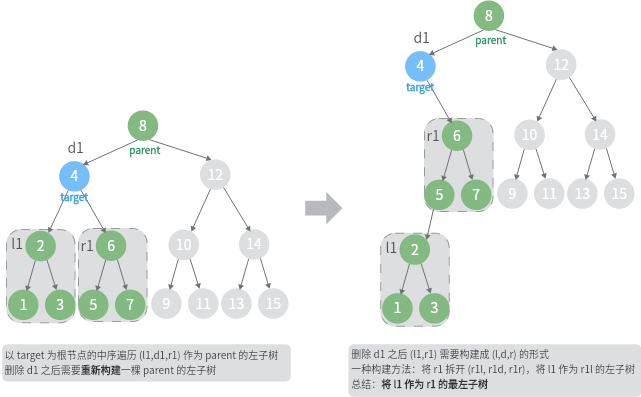
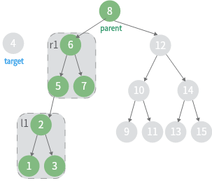
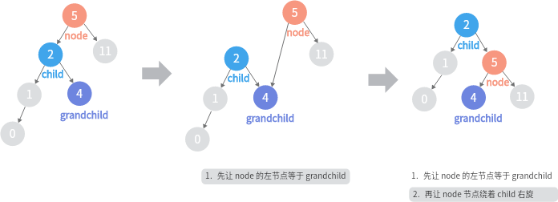
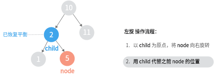

<!--more-->

## 一、树的四种遍历

深度优先遍历（DFS）：前序（DLR）、中序（LDR）、后序（LRD）

广度优先遍历（BFS）：层序遍历

节点的定义：
```go
type treeNode struct {
	val    int
	left   *treeNode
	right  *treeNode
}
```

### 前序

=== "递归"

	```go
	// 前序遍历: 访问根节点，以前序遍历的方式访问左节点，以前序遍历的方式访问右节点  
	func pOrder(root *treeNode)  {  
		// end  
		if root == nil {  
			return  
		}  

		fmt.Printf("%d ", root.val)
		pOrder(root.left)  
		pOrder(root.right)  
		return  
	}
	```	

=== "非递归"

	```go
	func pOrderStack(root *treeNode)  {  
		if root == nil {  
			return  
		}  
		
		var st []*treeNode  
		st = append(st, root)  
		var pnt []int  
		for len(st) > 0 {  
			// 出栈，访问节点
			cur := st[len(st)-1]  
			st = st[:len(st)-1]  
			pnt = append(pnt, cur.val)  
		
			// 右节点入栈（存在的话）
			if cur.right != nil {  
				st = append(st, cur.right)  
			}  
			// 左节点入栈
			if cur.left != nil {  
				st = append(st, cur.left)  
			}  
		}  
		fmt.Println(pnt)  
	}
	```

### 中序

=== "递归"

	```go
	// 按中序遍历访问左节点，访问节点元素，按中序遍历访问右节点  
	func ldrOrder(root *treeNode)  {  
		if root == nil {  
			return  
		}  
		
		ldrOrder(root.left)  
		fmt.Printf("%d ", root.val)  
		ldrOrder(root.right)  
		
		return  
	}
	```

=== "非递归"

	1. 从根节点开始入栈，一直往左，直到最左叶子节点
	2. 出栈，访问节点
	3. 将右节点当作步骤1的根节点（若存在）
	
	```go
	// 代码优化
	func ldrOrderStack2(root *treeNode) {  
		if root == nil {  
			return  
		}  
		
		var st []*treeNode  
		// 出栈，访问元素  
		// 如果存在右节点，继续入栈，直到最左叶子节点  
		var pnt []int  
		tmp := root  
		for len(st) > 0 || tmp != nil {  
			// 入栈直到最左节点  
			for tmp != nil {  
				st = append(st, tmp)  
				tmp = tmp.left  
			}  
		
			// 出栈，访问节点元素  
			tmp = st[len(st)-1]  
			st = st[:len(st)-1]  
			pnt = append(pnt, tmp.val)  
			// 继续找右节点的最左叶子节点  
			tmp = tmp.right  
		}  
		
		return  
	}
	```

### 后序

=== "递归"

	```go
	func lrdOrder(root *treeNode)  {  
		if root == nil {  
			return  
		}  
		
		lrdOrder(root.left)  
		lrdOrder(root.right)  
		fmt.Printf("%d ", root.val)  
		
		return  
	}
	```

=== "非递归"

	1. 从根节点开始入栈，直到最左节点
	2. **获取**栈顶，判断右节点
		- 右节点不存在：访问该节点，**出栈**
		- 右节点已经访问过：访问该节点，**出栈**
		- 右节点未访问，进入步骤3
	3. 将该右节点当作步骤1的根节点

	```go
	func lrdOrderStack(root *treeNode)  {  
		var st []*treeNode  
		tmpRoot := root  
		pre := root  
		for len(st) > 0 || tmpRoot != nil {  
			for tmpRoot != nil {  
				st = append(st, tmpRoot)  
				tmpRoot = tmpRoot.left  
			}  
		
			tmpRoot = st[len(st)-1]  
			// 当节点右节点为空 或者 右子树已经访问过的情况下，访问根节点  
			if tmpRoot.right == nil || tmpRoot.right == pre {  
				fmt.Printf("%d ", tmpRoot.val)  
				pre = tmpRoot  
				tmpRoot = nil  // 将当前节点标记为空，避免下一个循环又将该节点入栈  
				st = st[:len(st)-1]  
			} else {  
				// 右节点还没访问，后序遍历右节点  
				tmpRoot = tmpRoot.right  
			}  
		}  
		return  
	}
	```

### 层序

层序遍历使用**队列**实现：

```go
func levelOrder(root *treeNode)  {  
	if root == nil {  
		return  
	}  
	var queue []*treeNode  
	queue = append(queue, root)  
	for len(queue) > 0 {  
		cur := queue[0]  
		queue = queue[1:]  
		fmt.Printf("%d ", cur.val)  
	
		if cur.left != nil {  
			queue = append(queue, cur.left)  
		}  
		if cur.right != nil {  
			queue = append(queue, cur.right)  
		}  
	}  
	return  
}
```

### 四种遍历的时间、空间复杂度

|遍历|时间复杂度|空间复杂度|
|-|-|-|
|先序|O(n)<br>递归调用的时间复杂度为O(1)，递归调用的次数为数中节点的数量n|栈实现的空间复杂度为：O(h)<br>h为数的高度<br>在较差的情况下，h = n；如果是平衡二叉树，h = logn|
|中序|O(n)|同上|
|后序|O(n)|同上|
|层序|O(n)|O(w)<br>w 为树的宽度|

### 一些常见问题

??? note "判断子树"

	**思路1**. 递归

	子问题是：判断左右子树是否会等于预期的子树（判断左右子树是否相等的问题也可以递归来实现）

	```go
	// 判断根节点为起始的树与目标树是否相同  
	// 如果不相同，递归判断左子树和右子树  
	func isSubtree(root *TreeNode, subRoot *TreeNode) bool {  
		if root == nil && subRoot == nil {  
			return true  
		}  
		if root == nil {  
			return false  
		}  
		if isSameTree(root, subRoot) {  
			return true  
		}  
		return isSubtree(root.Left, subRoot) || isSubtree(root.Right, subRoot)  
	}

	func isSameTree(p *TreeNode, q *TreeNode) bool {  
		if p == nil && q == nil {  
			return true  
		}  
		if p == nil || q == nil {  
			return false  
		}  
		if p.Val != q.Val {  
			return false  
		}  
		
		return isSameTree(p.Left, q.Left) && isSameTree(p.Right, q.Right)  
	}
	```

	**思路2**. dfs（先序） + kmp

	设主树s，子树t，主树的先序序列 ss，子树的先序序列 tt

	利用先序序列的性质：

	如果A.【 t 是 s 的子树】 那么B.【ss 中 包含 tt】

	可以知道 B 是 A 的必要条件，是没有办法从 B 推出 A 的，原因是什么呢，假设主树：[4, 5]，子树：[4, nil, 5]，这种情况下的先序序列都是 4 5，但是两颗树是不一样的

	但是我们可以通过补充两个代表空的左右节点来解决这个问题

	```go
	// 通过树的先序遍历  
	// 补充树的每个节点，让度为2，输出树的先序遍历  
	// 判断主树的序列包含子树的序列  
	func isSubtree2(root *TreeNode, subRoot *TreeNode) bool {  
		nums1 := dlrNums(root)  
		nums2 := dlrNums(subRoot)  
		return kmpSearch(nums1, nums2)  
	}  
	
	const lrNilVal = -10001  
	var leftNilNode = TreeNode{  
		Val: lrNilVal,  
	}  
	var rightNilNode = TreeNode{  
		Val: lrNilVal,  
	}  
	
	func dlrNums(root *TreeNode) []int {  
		var nums []int  
		if root == nil {  
			return nums  
		}  
		
		var st []*TreeNode  
		st = append(st, root)  
		tmpRoot := root  
		for len(st) > 0 {  
			// pop  
			tmpRoot = st[len(st) - 1]  
			st = st[:len(st) - 1]  
			// visit  
			nums = append(nums, tmpRoot.Val)  
			if tmpRoot.Val != lrNilVal && tmpRoot.Left == nil {  
				tmpRoot.Left = &leftNilNode  
			}  
			if tmpRoot.Val != lrNilVal && tmpRoot.Right == nil {  
				tmpRoot.Right = &rightNilNode  
			}  
		
			if tmpRoot.Right != nil {  
				st = append(st, tmpRoot.Right)  
			}  
			if tmpRoot.Left != nil {  
				st = append(st, tmpRoot.Left)  
			}  
		}  
		return nums  
	}  
	
	// i  
	//     nums a a  b  a  a  b  a  a  c  
	// pat  
	// j  
	func kmpSearch(nums, pat []int) bool {  
		next := getNext(pat)  
		j := 0  
		for i := 0; j < len(pat) && i < len(nums); i++ {  
			for ; j > 0 && nums[i] != pat[j]; j = next[j-1]{}  
		
			if nums[i] == pat[j] {  
				j++  
			}  
		}  
		
		return j == len(pat)  
	}  
	
	func  getNext(pat []int) []int {  
		next := make([]int, len(pat))  
		next[0] = 0  
		
		for l, j := 0, 1 ; j < len(pat); j++ {  
			for l > 0 && pat[l] != pat[j] {l = next[l-1]}  
		
			if pat[l] == pat[j] {  
				l++  
			}  
			next[j] = l  
		}  
		return next  
	}
	```

!!! abstract "学到了！"

	判断子树可以通过**补充空子树**，然后使用**先序序列**来判断

??? note "是否存在路径和为 sum"

	思路：递归

	原问题：是否存在从当前节点（根节点）到叶子节点的路径，和为 sum 子问题：是否存在从当前节点（根节点的子节点）到叶子节点的路径，和为 sum - val（父节点的值）

	结束条件：当前节点为叶子节点

	```go
	func hasPathSum(root *TreeNode, targetSum int) bool {
		if root == nil {
			return false
		}
		return havePathToLeaf(root, targetSum)
	}


	func havePathToLeaf(root *TreeNode, tgtSum int) bool {  
		// end  
		if root.Left == nil && root.Right == nil {  
			return root.Val == tgtSum  
		}  
		
		have1, have2 := false, false  
		if root.Left != nil {  
			have1 = havePathToLeaf(root.Left, tgtSum - root.Val)  
		}  
		if root.Right != nil {  
			have2 = havePathToLeaf(root.Right, tgtSum - root.Val)  
		}  
		
		return have1 || have2  
	}
	```

## 二、二叉搜索树

二叉搜索树：`左子树所有节点的值` < `根节点` < `右子树所有节点的值`

### 添加节点

=== "递归"

	转化成 `递归插入左子树或者右子树` 即可

	```go
	func insertIntoBST(root *TreeNode, val int) *TreeNode {  
		if root == nil {  
			return &TreeNode{  
				Val: val,  
			}  
		}  
		
		if val < root.Val {  
			root.Left = insertIntoBST(root.Left, val)  
		} else {  
			root.Right = insertIntoBST(root.Right, val)  
		}  
		return root  
	}
	```

=== "非递归"

	```go
	func insertIntoBST2(root *TreeNode, val int) *TreeNode {  
		if root == nil {  
			return &TreeNode{  
				Val: val,  
			}  
		}  
		
		pre := root  
		tmpRoot := root  
		for tmpRoot != nil {  
			if val < tmpRoot.Val {  
				pre = tmpRoot  
				tmpRoot = tmpRoot.Left  
			} else {  
				pre = tmpRoot  
				tmpRoot = tmpRoot.Right  
			}  
		}  
		newNode := &TreeNode{Val: val}  
		if val < pre.Val {  
			pre.Left = newNode  
		} else {  
			pre.Right = newNode  
		}  
		return root  
	}
	```

### 删除节点

根据待删除节点的子树数量分为三种情况讨论：

- 没有子树
- 一棵子树
- 两棵子树

#### 先给出具体实现

=== "实现1.嫁接"

	```go
	// delete 使用「嫁接」的方式来删除
	func (bst *binarySearchTree) delete(val int)  {
		tgt := bst.root
		if tgt == nil {
			return
		}

		var parent *treeNode = nil
		for tgt != nil {
			// 找到目标节点（待删除节点）
			if tgt.val == val {
				break
			}

			parent = tgt
			if val < tgt.val {
				tgt = tgt.left
			} else {
				tgt = tgt.right
			}
		}

		// 不存在
		if tgt == nil {
			return
		}

		// 不存在子树或者只有一棵子树的情况
		// - 若存在子树，则使用子树代替待删除节点即可
		// - 否则直接将待删除节点删除
		if tgt.left == nil || tgt.right == nil {
			if tgt.left == nil {
				tgt = tgt.left
			} else {
				tgt = tgt.right
			}

		// 存在两棵子树的情况
		// child 为右节点根节点
		} else {
			tmp := tgt.right
			// 将待删除节点的左子树嫁接到右子树的最左节点
			for tmp.left != nil {
				tmp = tmp.left
			}
			tmp.left = tgt.left

			tgt = tgt.right
		}

		if parent == nil {
			bst.root = tgt
			return
		}
		if parent.left != nil && parent.left.val == val {
			parent.left = tgt
		} else {
			parent.right = tgt
		}
	}
	```

=== "实现2.后继节点"

	```go
	func (bst *binarySearchTree) delete(num int) {
		cur := bst.root
		// 若树为空，直接提前返回
		if cur == nil {
			return
		}
		// 待删除节点之前的节点位置
		var pre *treeNode = nil
		// 循环查找，越过叶节点后跳出
		for cur != nil {
			if cur.val == num {
				break
			}
			pre = cur
			if cur.val < num {
				// 待删除节点在右子树中
				cur = cur.right
			} else {
				// 待删除节点在左子树中
				cur = cur.right
			}
		}
		// 若无待删除节点，则直接返回
		if cur == nil {
			return
		}
		// 子节点数为 0 或 1
		if cur.left == nil || cur.right == nil {
			var child *treeNode = nil
			// 取出待删除节点的子节点
			if cur.left != nil {
				child = cur.left
			} else {
				child = cur.right
			}
			// 将子节点替换为待删除节点
			if pre.left == cur {
				pre.left = child
			} else {
				pre.right = child
			}
			// 子节点数为 2
		} else {
			// 获取中序遍历中待删除节点 cur 的下一个节点
			tmp := cur.right
			for tmp.left != nil {
				tmp = tmp.left
			}
			// 递归删除节点 tmp
			bst.remove2(tmp.val)
			// 用 tmp 覆盖 cur
			cur.val = tmp.val
		}
	}
	```

#### 子树数量 = 0

  

#### 子树数量 = 1

  

#### 子树数量 = 2

=== "step 1"

	找到目标节点

	  

=== "step 2"

	将 `目标节点的字数数量变成 1` （有多种不同的实现方式，这里使用的是嫁接的方式）

	  

=== "step 3"

	经过第二步的处理之后，就变成了子树数量 = 1 的情况

	  

**总结：**

|子树数量|操作|
|-|-|
|0|直接删除|
|1|子树代替目标节点|
|2|重新构建子树，使其只有一颗子树，然后使用上面方法|

### 构建

### 判断是否是二叉搜索树

```go
// 从二叉搜索树当前节点的值可以推出左右节点的取值区间，递归判断每个节点即可
func isValidBST(root *TreeNode) bool {
    if root == nil {
        return true
    }
    return jud(root, math.MinInt, math.MaxInt)
}
 
func jud(root *TreeNode, start, end int) bool {
    if root == nil {
        return true
    }
    if root.Val <= start || root.Val >= end {
        return false
    }
  
    return jud(root.Left, start, root.Val) && jud(root.Right, root.Val, end)
}
```

## 三、AVL - 二叉平衡搜索树

在二叉树的基础上，满足平衡性

!!! note "平衡性"

	在某些情况下，二叉搜索树可能退化成类似链表的情况，为了避免这种情况引入平衡性。

	平衡性使用`平衡因子`来体现，平衡因子 = `|h(ls) - h(rs)|`

	即左右子树的高度差不能超过 1


|树类型|最坏情况下的时间复杂度|插入、删除、查找|
|-|-|-|
|二叉搜索树|`O(n)`(当整棵树只有左节点或者只有右节点的情况)|`O(logn)`|
|平衡二叉搜索树|`O(logn)`|效率更高(都为`O(logn)`)|

!!! tip "空树"

	空树也是一棵 AVL 树

### 节点高度、平衡因子

```go
type treeNode struct {  
	val    int  
	height int // 节点高度  
	left   *treeNode  
	right  *treeNode  
}
```

!!! note "节点高度"

	- **节点高度** 表示节点到最远叶子节点的举例（也就是边的数量）
	- 叶子节点的高度 = 0
	- 空节点的高度 = -1

`获取节点高度` `更新节点高度`：

```go
func (t *avlTree) getHeight(node *treeNode) int {  
	// 空节点高度为 -1   if node == nil {  
		return -1  
	}  
	return node.height  
}  
  
func (t *avlTree) updateHeight(node *treeNode) {  
	// 节点高度等于最高子树的高度 + 1   
	t.height = max(t.getHeight(node.left), t.getHeight(node.right)) + 1  
}
```

`获取节点平衡因子`

```go
// balanceFactor 获取平衡因子  
// 设平衡因子为 f，平衡二叉树的平衡因子需满足：-1 <= f <= 1  
func (t *avlTree) balanceFactor(node *treeNode) int {  
	// 空节点的平衡因子为 0   
	if node == nil {  
		return 0  
	}  
	// 节点平衡因子 = 左子树高度 - 右子树高度  
	return t.getHeight(node.left) - t.getHeight(node.right)  
}
```

### 四种旋转类型

AVL 的特点就在于旋转（Roration），通过旋转可以让二叉树不失衡，根据节点的失衡情况，可以将分为四种旋转方式：`左旋`、`右旋`、`先左旋再右旋`、`先右旋再左旋`

#### 左旋

具体图示分析与右旋类似

```go
func (t *avlTree) leftRotate(node *treeNode) *treeNode  {  
	child := node.right  
	// 消除碰撞，执行旋转  
	node.right = child.left  
	child.left = node  
	// 更新节点高度  
	t.updateHeight(node)  
	t.updateHeight(child)  
	
	return child  
}
```

#### 右旋

=== "step 1 添加节点"

	  

=== "step 2 失衡"

	添加节点之后**失衡**
	  

=== "step 3 聚焦"

	聚焦失衡的子树
	  

=== "step 4 旋转"

	  

	!!! warning "碰撞"

		这里的 `child` 节点是没有右节点的，因此 `node` 节点的右旋过程是顺利的。在右旋操作中，如果 `child` 存在右节点，是会产生**碰撞**（碰撞只是为了个人方便记住存在这种情况引入的一个概念）的，那么在旋转之前，就必须**消除碰撞**：让 `grandchild` 作为 `node` 的左节点

		一个有碰撞的例子：

		  

=== "step 5 子节点上移"

	  

```go
// 右旋，返回平衡子树的根节点  
func (t *avlTree) rightRotate(node *treeNode) *treeNode {  
	child := node.left  
	// 消除碰撞，执行旋转  
	node.left = child.right  
	child.right = node  
	// 更新节点高度  
	t.updateHeight(node)  
	t.updateHeight(child)  
	
	return child  
}
```

#### 先左旋后右旋

下面是同样的一颗 AVL 树，如果新节点添加在最左叶子节点的左节点，是能够通过一次右旋操作恢复平衡的，但是如果新节点**添加在最左叶子节点的右节点**，需要先通过一次`左旋`（这次左旋是不会产生碰撞的）达到类似于新节点是添加在最左边的效果，然后就能通过上面提到的`右旋`操作来恢复平衡

  

#### 先右旋后左旋

相当于「先左旋后右旋」的镜像操作

#### 「旋转」总结

  

设平衡因子为 f
- 左偏树：f > 1
- 右偏树：f < -1

我们可以通过分别判断 node 和 child 的平衡因子来选择执行哪种旋转操作

|失衡节点的 f|子节点的 f|操作|
|:-:|:-:|:-:|
|> 1|>= 0|右旋|
|> 1|< 0|先左旋后右旋|
|< -1|<= 0|左旋|
|< -1|> 0|先右旋后左旋|

```go
func (t *avlTree) rotate(node *treeNode) *treeNode {  
	// 失衡节点的平衡因子  
	bf := t.balanceFactor(node)  
	if bf > 1 {  
		if t.balanceFactor(node.left) >= 0 {  
			return t.rightRotate(node)  
		} else {  
			// 先左旋，后右旋  
			node.left = t.leftRotate(node.left)  
			return t.rightRotate(node)  
		}  
	} else if bf < -1 {  
		if t.balanceFactor(node.right) <= 0 {  
			return t.leftRotate(node)  
		} else {  
			// 先右旋，后左旋  
			node.right = t.rightRotate(node.right)  
			return t.leftRotate(node)  
		}  
	}  
	// 已经是平衡状态  
	return node  
}
```
### 插入节点

平衡二叉搜索树在节点插入之后要维持树的平衡，从插入的节点开始，需要 **`自底向上执行旋转操作，使所有失衡节点恢复平衡`** 

```go
func (t *avlTree) insert(val int)  {  
   	t.root = t.insertHelper(t.root, val)  
}  
  
func (t *avlTree) insertHelper(node *treeNode, val int) *treeNode {  
	if node == nil {  
		return &treeNode{  
			val: val,  
		}  
	}  
	
	/* 1. 插入 */   
	if val < node.val {  
		node.left = t.insertHelper(node.left, val)  
	} else if val > node.val {  
		node.right = t.insertHelper(node.right, val)  
	} else {  
		// 重复节点不插入  
		return node  
	}  
	
	// 更新节点高度  
	t.updateHeight(node)  
	/* 2.执行旋转，恢复平衡 */   
	node = t.rotate(node)  
	return node  
}
```

### 删除节点

```go
func (t *avlTree) remove(val int)  {  
   	t.removeHelper(t.root, val)  
}  
  
func (t *avlTree) removeHelper(node *treeNode, val int) *treeNode {  
	if node == nil {  
		return nil  
	}  
	
	if val < node.val {  
		node.left = t.removeHelper(node.left, val)  
	} else if val > node.val {  
		node.right = t.removeHelper(node.right, val)  
	} else {  
		if node.left == nil || node.right == nil {  
			child := node.left  
			if node.right != nil {  
				child = node.right  
			}  
	
			if child == nil {  
				// 没有子树，直接删除节点即可  
				return nil  
			} else {  
				// 有至多一个节点，返回该节点  
				return child  
			}  
		} else {  
			// 子节点的数量为 2，删除当前节点的后继节点，并用后继节点的值替换当前节点  
			tmp := node.right  
			for tmp.left != nil {  
				tmp = tmp.left  
			}  
	
			// 递归删除这个后继节点  
			node.right = t.removeHelper(node.right, tmp.val)  
			// 替换当前节点  
			node.val = tmp.val  
		}  
	}  
	
	// 更新节点高度  
	t.updateHeight(node)  
	/* 执行旋转，保持平衡 */   
	node = t.rotate(node)  
	return node  
}
```

## (待补充...)