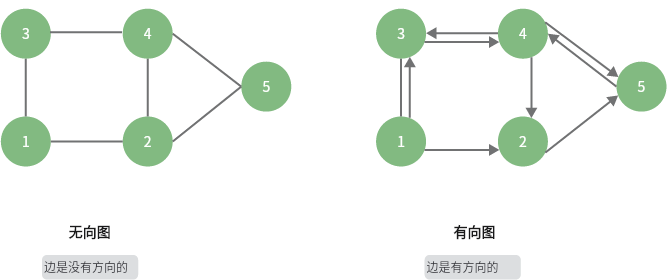
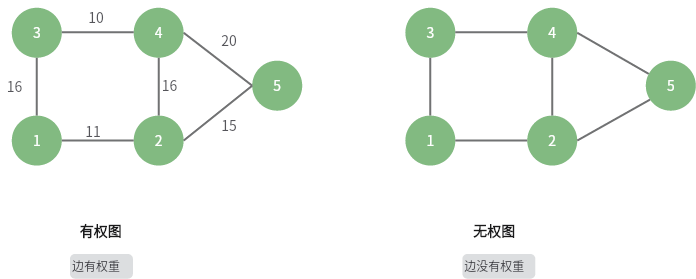

<!--more-->

## 图

### 概念

定义：G = (V, E)

  

图的分类

=== "边是否有方向"

	  

=== "是否有环"

	  

=== "连通、非连通"

	  

=== "边是否有权重"

	  

### 表示

- 顺序
- 链式

一个无向图的例子，展示如何用「邻接矩阵」和「邻接表」来表示一个图：

  

邻接矩阵中保存着很多不存在的边，由于二维数组的连续性，会**浪费很多空间，但是查询速度快 O(1)**；在邻接表中，采用了一个数组来保存图的所有点，每个元素扩展成一个链表，只保存存在的边，**节省空间，但是查询效率 O(n)**，可以通过一些手段来优化这个链表，比如将链表转化为 AVL 或者 红黑树，查询效率能够优化到 O(logn)，或者采用哈希表，再将时间复杂度降至 O(1)

??? abstract "使用 map 实现无向图"

	```go
	type vertex struct {  
		val int  
	}  
	
	/* 基于邻接表实现的无向图 */
	type graphAdjMp struct {  
		adjMp map[vertex]map[vertex]struct{}  
	}  
	
	func (g *graphAdjMp) addVertex(v vertex)  {  
		if _, ok := g.adjMp[v]; ok {  
			// 该顶点已经存在，无需重复加入  
			return  
		}  
		// 新加一个节点，以及初始化一个链表  
		g.adjMp[v] = map[vertex]struct{}{}  
	}  
	
	func (g *graphAdjMp) deleteVertex(v vertex)  {  
		if _, ok := g.adjMp[v]; !ok {  
			// 节点是不存在的  
			return  
		}  
		/* 1.删除顶点 */   
		delete(g.adjMp, v)  
		/* 2.删除其他顶点中与之存在的关联 */   
		for _, rt := range g.adjMp {  
			delete(rt, v)  
		}  
	}  
	
	func (g *graphAdjMp) addEdge(v1, v2 vertex)  {  
		_, ok1 := g.adjMp[v1]  
		_, ok2 := g.adjMp[v2]  
		if !ok1 || !ok2 || v1 == v2 {  
			log.Fatal("add edge error")  
		}  
		g.adjMp[v1][v2] = struct{}{}  
		g.adjMp[v2][v1] = struct{}{}  
	}  
	
	func (g *graphAdjMp) deleteEdge(v1, v2 vertex) {  
		_, ok1 := g.adjMp[v1]  
		_, ok2 := g.adjMp[v2]  
		if !ok1 || !ok2 || v1 == v2 {  
			log.Fatal("delete edge error")  
		}  
		delete(g.adjMp[v1], v2)  
		delete(g.adjMp[v2], v1)  
	}  
	
	
	// newGraphAdjMp 使用边来初始化一个图  
	// edges 的形式应该是 [(v1,v2),(v1,v3)...]
	func newGraphAdjMp(edges [][]vertex) *graphAdjMp {  
		g := &graphAdjMp{  
			adjMp: make(map[vertex]map[vertex]struct{}),  
		}  
		for _, e := range edges {  
			g.addVertex(e[0])  
			g.addVertex(e[1])  
			g.addEdge(e[0], e[1])  
		}  
		return g  
	}  
	
	func (g *graphAdjMp) print()  {  
		if g.adjMp == nil {  
			fmt.Println("graph is nil")  
		}  
		for vt, toMp := range g.adjMp {  
			fmt.Print("vertex#", vt, "have edge: ")  
			for toVt := range toMp {  
				fmt.Print("(", vt.val, toVt.val, ")")  
			}  
			fmt.Println()  
		}  
	}
	```
### 图的遍历

#### 深度优先（DFS）

  

```go
func (g *graphAdjMp) dfs(startVt vertex) []vertex {  
	visited := make(map[vertex]struct{})  
	var visitRst []vertex  
	g.dfsHelper(startVt, visited, &visitRst)  
	return visitRst  
}  
  
func (g *graphAdjMp) dfsHelper(startVt vertex, visited map[vertex]struct{}, visitRst *[]vertex)  {  
	*visitRst = append(*visitRst, startVt)  
	visited[startVt] = struct{}{}  
	for toVt := range g.adjMp[startVt] {  
		if _, ok := visited[toVt]; ok {  
			continue  
		}  
	
		g.dfsHelper(toVt, visited, visitRst)  
	}  
}
```

#### 广度优先（BFS）

  

```go
func (g *graphAdjMp) bfs(startVt vertex) []vertex {  
	if g.adjMp == nil {  
		fmt.Println("graph is nil")  
	}  
	
	var queue []vertex  
	visited := make(map[vertex]struct{})  
	var visitRst []vertex  
	
	// visitRst 用来存储访问结果  
	visitRst = append(visitRst, startVt)  
	// 标记已经访问  
	visited[startVt] = struct{}{}  
	queue = append(queue, startVt)  
	
	for len(queue) > 0 {  
		cur := queue[0]  
		queue = queue[1:]  
		// 遍历相邻节点，如果还没访问，就访问，并加入队列  
		for toVt, _ := range g.adjMp[cur] {  
			if _, ok := visited[toVt]; ok {  
				// 节点已经访问过，跳过  
				continue  
			}  
	
			visitRst = append(visitRst, toVt)  
			visited[toVt] = struct{}{}  
			queue = append(queue, toVt)  
		}  
	}  
	return visitRst  
}
```

时间复杂度，所有的节点都会入队列一次，时间 O(|V|)，每条边都会遍历两次，时间 O(2|E|)，总的时间复杂度 O(|V|+|E|)


---
1. https://www.hello-algo.com/chapter_graph/graph_traversal/#932