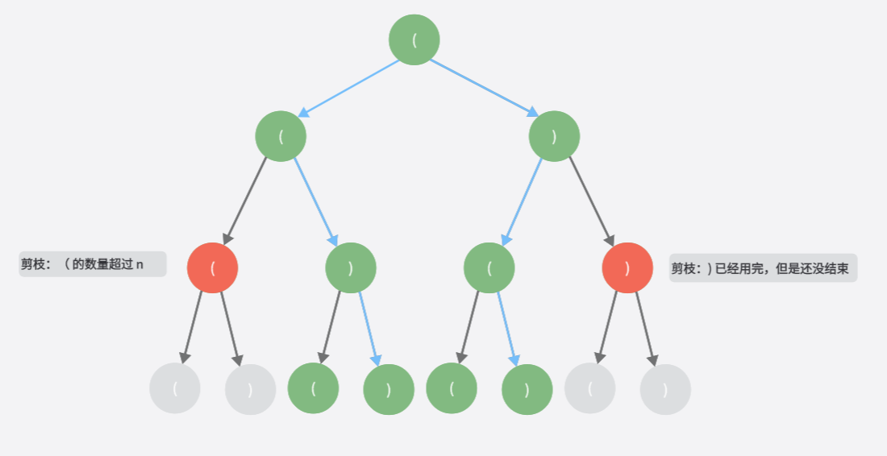

<!--more-->

## 树的常规操作

### 树的遍历

#### 先序遍历

- [22. 括号生成](https://leetcode.cn/problems/generate-parentheses/)

???quote "code"

	使用二叉树前序遍历的方法
	
	```go
	func generateParenthesis(n int) []string {
		var path []byte
		ans := make([]string, 0)
		dlr(path, '(', n, &ans)
		return ans
	}

	func dlr(path []byte, ch byte, n int, ans *[]string) {
		// 访问节点
		path = append(path, ch)
		if len(path) == n*2 {
			if isValid(path) {
				*ans = append(*ans, string(path))
			}
			return
		}

		dlr(path, '(', n, ans)
		dlr(path, ')', n, ans)
		return
	}

	func isValid(pat []byte) bool {
		var stack []byte
		for i := 0; i < len(pat); i++ {
			if len(stack) != 0 && stack[len(stack)-1] == '(' && pat[i] == ')' {
				stack = stack[:len(stack)-1]
			} else {
				stack = append(stack, pat[i])
			}
		}
		return len(stack) == 0
	}
	```

	这样做会导致一些不必要的工作,假设当 n = 2,可以看成这样一棵二叉树

	  


	总共会走 2^(2n-1) = 8 条路径,但是只有 2 条是符合条件的

	可以发现一些规律:
	
	- 如果左括号等于 n 了,之后就只能选择右括号
	- 如果目前的状态中,左括号的数量比右括号少,那么一定是不符合条件的,因为最后一定有一个左括号是没有右括号匹配的,所以如果现在的右括号等于左括号,那么下一个只能选择左括号

	优化的代码:

	```go hl_lines="4 18 24" linenums="1"
	func generateParenthesis(n int) []string {
		var path []byte
		ans := make([]string, 0)
		// 新增一个数组来保存当前状态左括号和右括号的数量
		xy := [2]uint8{0, 0}
		xy[0] = 1
		dlr(path, xy[:], '(', uint8(n), &ans)
		return ans
	}

	func dlr(path []byte, xy []uint8, ch byte, n uint8, ans *[]string) {
		path = append(path, ch)
		if len(path) == int(n*2) {
			*ans = append(*ans, string(path))
		}

		// 左括号的数量 < n 的时候，才能继续选择左括号作为下一个符号
		if xy[0] < n {
			xy[0]++
			dlr(path, xy, '(', n, ans)
			xy[0]--
		}
		// 只有当右括号 < 左括号，下一个才有可能选右括号
		if xy[1] < xy[0] {
			xy[1]++
			dlr(path, xy, ')', n, ans)
			xy[1]--
		}
		return
	}
	```


## 二叉树

### 根据输出序列构造二叉树

#### [105. 从前序与中序遍历序列构造二叉树](https://leetcode.cn/problems/construct-binary-tree-from-preorder-and-inorder-traversal/)

???quote "code"
	```go
	/**
	 * Definition for a binary tree node.
	 * type TreeNode struct {
	 *     Val int
	 *     Left *TreeNode
	 *     Right *TreeNode
	 * }
	 */
	func buildTree(preorder []int, inorder []int) *TreeNode {
	    if len(preorder) == 0 {
			return nil
		}
		rootIdx1 := 0
		rootIdx2 := indexOf(inorder, preorder[rootIdx1])
		root := &TreeNode{
			Val: preorder[rootIdx1],
		}
		
		inorder1 := inorder[0:rootIdx2]
		inorder2 := inorder[rootIdx2 + 1:]
		preorder1 := preorder[1: 1 + len(inorder1)]
		preorder2 := preorder[1+len(inorder1):]
		left := buildTree(preorder1, inorder1)
		right := buildTree(preorder2, inorder2)
		root.Left = left
		root.Right = right
		return root
	}
	
	func indexOf(nums []int, tgt int) int {
		for i, num := range nums {
			if tgt == num {
				return i
			}
		}
		return -1
	}
	```

### 其他问题

#### [101. 对称二叉树](https://leetcode.cn/problems/symmetric-tree/)
???quote "code"
	```go
	/**
	 * Definition for a binary tree node.
	 * type TreeNode struct {
	 *     Val int
	 *     Left *TreeNode
	 *     Right *TreeNode
	 * }
	 */
	func isSymmetric(root *TreeNode) bool {
	    if root == nil {
			return true
		}
		var q []*TreeNode
		
		q = append(q, root)
		for len(q) > 0 {
	
			var nums []int
			// get head
			n := len(q)
			for i := 0; i < n; i++ {
				if q[i] != nil {
					nums = append(nums, q[i].Val)
					q = append(q, q[i].Left)
					q = append(q, q[i].Right)
				} else {
					nums = append(nums, -101)
				}
			}
			q = q[n:]
			// jud
			for i, n := 0, len(nums); i < n / 2; i++ {
				if nums[i] != nums[n-i-1] {
					return false
				}
			}
		}
		return true
	}
	```
#### [112. 路径总和](https://leetcode.cn/problems/path-sum/)
???quote "code"
	```go
	/**
	 * Definition for a binary tree node.
	 * type TreeNode struct {
	 *     Val int
	 *     Left *TreeNode
	 *     Right *TreeNode
	 * }
	 */
	func hasPathSum(root *TreeNode, targetSum int) bool {
	    if root == nil {
	        return false
	    }
		return havePathToLeaf(root, targetSum)
	}
	
	func havePathToLeaf(root *TreeNode, tgtSum int) bool {
		// end
		if root.Left == nil && root.Right == nil {
			return root.Val == tgtSum
		}
	
		have1, have2 := false, false
		if root.Left != nil {
			have1 = havePathToLeaf(root.Left, tgtSum - root.Val)
		}
		if root.Right != nil {
			have2 = havePathToLeaf(root.Right, tgtSum - root.Val)
		}
	
		return have1 || have2
	}
	```

#### [113. 路径总和 II](https://leetcode.cn/problems/path-sum-ii/)
???quote "code"
	```go
	/**
	 * Definition for a binary tree node.
	 * type TreeNode struct {
	 *     Val int
	 *     Left *TreeNode
	 *     Right *TreeNode
	 * }
	 */
	func pathSum(root *TreeNode, targetSum int) [][]int {
	    var st []*TreeNode
		var ans [][]int
		if root == nil {
			return ans
		}
		
		tmpRoot := root
		pre := root
		for len(st) > 0 || tmpRoot != nil {
			for tmpRoot != nil {
				st = append(st, tmpRoot)
				tmpRoot = tmpRoot.Left
			}
			
			tmpRoot = st[len(st)-1]
			if tmpRoot.Right == nil || tmpRoot.Right == pre {
				// visit
				if tmpRoot.Left == nil && tmpRoot.Right == nil {
					sum := 0
					var path []int
					for _, node := range st {
						sum += node.Val
						path = append(path, node.Val)
					}
					if sum == targetSum {
						ans = append(ans, path)
					}
				}
				
				st = st[:len(st)-1]
				pre = tmpRoot
				tmpRoot = nil
			} else {
				tmpRoot = tmpRoot.Right
			}
		} 
		return ans
	}
	```

#### [236. 二叉树的最近公共祖先](https://leetcode.cn/problems/lowest-common-ancestor-of-a-binary-tree/)

???quote "code"

	```go
	/**
	 * Definition for a binary tree node.
	 * type TreeNode struct {
	 *     Val int
	 *     Left *TreeNode
	 *     Right *TreeNode
	 * }
	 */
	 func lowestCommonAncestor(root, p, q *TreeNode) *TreeNode {
	     if root == nil {
			return nil
		}
		
		var st []*TreeNode
		var path1, path2 []int
		tmpRoot := root
		pre := root
		for len(st) > 0 || tmpRoot != nil {
			for tmpRoot != nil {
				st = append(st, tmpRoot)
				tmpRoot = tmpRoot.Left
			}
			
			// get
			tmpRoot = st[len(st) - 1]
			if tmpRoot.Right == nil || pre == tmpRoot.Right {
				// visit
				if tmpRoot.Val == p.Val {
					for _, node := range st {
						path1 = append(path1, node.Val)
					}
				}
				if tmpRoot.Val == q.Val {
					for _, node := range st {
						path2 = append(path2, node.Val)
					}
				}
				
				st = st[:len(st)-1]
				pre = tmpRoot
				tmpRoot = nil
			} else {
				tmpRoot = tmpRoot.Right
			}
		}
		
		valIdx := map[int]int{}
		idxMax := math.MinInt
		for i, val := range path1 {
			valIdx[val] = i
		}
		for _, val := range path2 {
			if i, ok := valIdx[val]; ok && idxMax < i {
				idxMax = i
			}
		}
		return &TreeNode{
			Val: path1[idxMax],
		}
	}
	```

#### [199. 二叉树的右视图](https://leetcode.cn/problems/binary-tree-right-side-view/)
???quote "code"
	```go
	/**
	 * Definition for a binary tree node.
	 * type TreeNode struct {
	 *     Val int
	 *     Left *TreeNode
	 *     Right *TreeNode
	 * }
	 */
	func rightSideView(root *TreeNode) []int {
	    var ans []int
		if root == nil {
			return ans
		}
	
		var st []*TreeNode
		tmpNode := root
		pre := root
		for len(st) > 0 || tmpNode != nil {
			for tmpNode != nil {
				st = append(st, tmpNode)
				if len(st) > len(ans) {
					ans = append(ans, tmpNode.Val)
				}
				tmpNode = tmpNode.Right
			}
	
			// 判断是否该访问该节点
			tmpNode = st[len(st)-1]
			if tmpNode.Left == nil || tmpNode.Left == pre {
	
				pre = tmpNode
				tmpNode = nil
				st = st[:len(st)-1]
			} else {
				tmpNode = tmpNode.Left
			}
		}
		return ans
	}
	```

#### [958. 二叉树的完全性检验](https://leetcode.cn/problems/check-completeness-of-a-binary-tree/)

???quote "code"
	```go
	/**
	 * Definition for a binary tree node.
	 * type TreeNode struct {
	 *     Val int
	 *     Left *TreeNode
	 *     Right *TreeNode
	 * }
	 */
	 // bfs
	 // 第一层 1    2的0次方
	 // 第二层 2    2的1次方
	 // ...
	 // 遍历每一层的的时候，计算下一层的节点数量，如果不等于 2 的 n 次方，判断当前层的子树情况
	 // 设定节点的几个状态：
	 // 有左右节点：    3
	 // 有左节点：      2
	 // 有右节点：      9
	 // 没有子节点：    0
	 // 那么：  3 后面必须是    3、2、0
	 //         2 后面必须是    0
	 //         0 后面必须是    0
	 //         如果包含 9 则不完全
	 // 或者说：    3 前面必须是    3
	 //             2 前面必须是    3
	 //             0 前面必须是    3 或者2
	func isCompleteTree(root *TreeNode) bool {
	    if root == nil || root.Left == nil && root.Right == nil {
			return true
		}
	
		var q []*TreeNode
		q = append(q, root)
		nextLevelNum := 2
		preState := 3    // 假设在前面补充一个状态最好的节点
		//curLevelFull := true
		for len(q) > 0 {
			width := len(q)
			childNum := 0
			for i:=0; i<width; i++ {
				node := q[i]
				nodeState := 3
				if node.Left != nil && node.Right != nil {
					nodeState = 3
					childNum += 2
					q = append(q, node.Left)
					q = append(q, node.Right)
				} else if node.Left != nil {
					nodeState = 2
					childNum += 1
					q = append(q, node.Left)
				} else if node.Right != nil {
					nodeState = 9
					childNum += 1
					q = append(q, node.Right)
				} else if node.Left == nil && node.Right == nil {
					nodeState = 0
				}
	
				//
				if nodeState == 9 {
					return false
				}
				if nodeState == 3 && preState != 3 {
					return false
				}
				if nodeState == 2 && preState != 3 {
					return false
				}
				if nodeState == 0 && preState == 3 || preState == 2{
					//
				}
	
				preState = nodeState
			}
	
			//if childNum != nextLevelNum && !curLevelFull {
			//	return false
			//}
			//if childNum != nextLevelNum {
			//	curLevelFull = false
			//}
			nextLevelNum *= 2
	
			q = q[width:]
		}
		return true
	}
	```

#### [572. 另一棵树的子树](https://leetcode.cn/problems/subtree-of-another-tree/)
???quote "code"
	```go
	/**
	 * Definition for a binary tree node.
	 * type TreeNode struct {
	 *     Val int
	 *     Left *TreeNode
	 *     Right *TreeNode
	 * }
	 */
	// 通过树的先序遍历
	// 补充树的每个节点，让度为2，输出树的先序遍历
	// 判断主树的序列包含子树的序列
	func isSubtree(root *TreeNode, subRoot *TreeNode) bool {
		nums1 := dlrNums(root)
		nums2 := dlrNums(subRoot)
		return kmpSearch(nums1, nums2)
	}
	
	const lrNilVal = -10001
	var leftNilNode = TreeNode{
		Val: lrNilVal,
	}
	var rightNilNode = TreeNode{
		Val: lrNilVal,
	}
	
	func dlrNums(root *TreeNode) []int {
		var nums []int
		if root == nil {
			return nums
		}
	
		var st []*TreeNode
		st = append(st, root)
		tmpRoot := root
		for len(st) > 0 {
			// pop
			tmpRoot = st[len(st) - 1]
			st = st[:len(st) - 1]
			// visit
			nums = append(nums, tmpRoot.Val)
			if tmpRoot.Val != lrNilVal && tmpRoot.Left == nil {
				tmpRoot.Left = &leftNilNode
			}
			if tmpRoot.Val != lrNilVal && tmpRoot.Right == nil {
				tmpRoot.Right = &rightNilNode
			}
	
			if tmpRoot.Right != nil {
				st = append(st, tmpRoot.Right)
			}
			if tmpRoot.Left != nil {
				st = append(st, tmpRoot.Left)
			}
		}
		return nums
	}
	
	//	i
	// 	nums a	a	b	a	a	b	a	a	c
	//	pat
	//	j
	func kmpSearch(nums, pat []int) bool {
		next := getNext(pat)
		j := 0
		for i := 0; j < len(pat) && i < len(nums); i++ {
			for ; j > 0 && nums[i] != pat[j]; j = next[j-1]{}
	
			if nums[i] == pat[j] {
				j++
			}
		}
	
		return j == len(pat)
	}
	
	func  getNext(pat []int) []int {
		next := make([]int, len(pat))
		next[0] = 0
	
		for l, j := 0, 1 ; j < len(pat); j++ {
			for l > 0 && pat[l] != pat[j] {l = next[l-1]}
	
			if pat[l] == pat[j] {
				l++
			}
			next[j] = l
		}
		return next
	}
	```

#### [116. 填充每个节点的下一个右侧节点指针](https://leetcode.cn/problems/populating-next-right-pointers-in-each-node/)
???quote "code"
	```go
	/**
	 * Definition for a Node.
	 * type Node struct {
	 *     Val int
	 *     Left *Node
	 *     Right *Node
	 *     Next *Node
	 * }
	 */
	func connect(root *Node) *Node {
	    if root == nil {
			return root
		}
		// 最下面一层，直接返回
		if root.Left == nil && root.Right == nil {
			return root
		}
		
		root.Left.Next = root.Right
		if root.Next != nil {
			root.Right.Next = root.Next.Left
		}
		connect(root.Left)
		connect(root.Right)
		return root
	}
	```

## 二叉搜索树

#### [98. 验证二叉搜索树](https://leetcode.cn/problems/validate-binary-search-tree/)
???quote "code"
	```go
	/**
	 * Definition for a binary tree node.
	 * type TreeNode struct {
	 *     Val int
	 *     Left *TreeNode
	 *     Right *TreeNode
	 * }
	 */
	// 递归实现
	// 从二叉搜索树当前节点的值可以推出左右节点的取值区间，递归判断每个节点即可
	func isValidBST(root *TreeNode) bool {
	    if root == nil {
	        return true
	    }
	    return jud(root, math.MinInt, math.MaxInt)
	}
	
	func jud(root *TreeNode, start, end int) bool {
	    if root == nil {
	        return true
	    }
	    
	    if root.Val <= start || root.Val >= end {
	        return false
	    }
	
	    return jud(root.Left, start, root.Val) && jud(root.Right, root.Val, end)
	}
	```


## AVL 树
