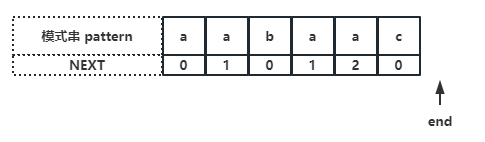

<!--more-->

## KMP

用途：字符串匹配

### 举例说明

S="aabaabaac", pattern="aabaac"

预期结果：主串中存在模式串，应该返回起始下标 -3

  

=== "step1"

	1. i 不会回头
	2. j 左侧的字符一定是已经经过比较的

	  


=== "step2"

	当 S[i] == pattern[j]
	
	i、j 均右移，继续往下比较

	  

=== "「step3」"

	当 S[i] != pattern[j]

	i 不动，**j 以一定的模式进行转移**，具体见下面的场景

	  

	??? note "j 如何移动？"

		（假设截取模式串 [0, j-1] 为 pattern‘）

		当发现当前比较的字符不同时：

		- 模式串找到 pattern’ 中**最长的相同前后缀**（假设为 comFix），如上图中的 B 和 C
		- 那么主串在下标 i 之前也必定有一个 comFix（由于 j 前面的字符一定的经过比较的），也就是上图中的 A

		所以 A = B = C，那么就可以把 j 的位置移动到 C 的下一个位置，这样就能够保证在 i 不回头的情况下，j 左边的字符都是已经经过比较的

		  

=== "step4"

	继续往下比较

	  


那么 KMP 的伪代码就很容易能够写出来：

```text hl_lines="2 4" linenums="1"
N M 为 S pattern 的长度
for i < N && j < M {
	字符不同
		循环：根据转移模式更新 j
		直到字符相同，或者已经是模式串的首字符

	if 字符相同
		j++
		i++
	否则
		i++
}
能够找到则 j == len(pattern)
	return i - M + 1
否则没有找到
	return -1
```

### 获取 Next 数组

KMP 算法中 j 的转移是通过一个保存 j 转移信息的数组 next 来实现的，那么如何获得这个数组是 KMP 算法的关键

首先根据 KMP 的工作流程可知，next 中保存的其实是最长公共前后缀的长度，也可以理解为最长公共前后缀中前缀的下一个下标

!!! note "next 保存了什么？"

	next[i] 保存了 pattern[0,i] 这个字符串最长公共前后缀的长度

举个例子说明：pattern = "aabaac"

  

最长相等前后缀长度：

|子串|最长公共前后缀|next|
|-|-|-|
|a|无(长度为1没有前缀与后缀)|0|
|aa|a|1|
|aab|无|0|
|aaba|a|1|
|aabaa|aa|2|
|aabaac|无|0|

如何在 O(M) 的时间复杂度内获得这个 next 数组？
使用两个指针，从头开始遍历 pattern：
- len：记录了最长公共前后缀的长度（初始 0）
- cur：子串结尾（初始 1）

=== "step1"

	首先初始化 next[0] = 0，所有的模式串都符合

	  

	判断 pattern[cur] == pattern[len]
	
	说明存在相同前后缀，那么将 len++，next[cur] = len（说明子串 pattern[0, cur] 的最长公共前缀长度为 len）
	再将 cur++，继续判断下一个子串

=== "step2"

	  

	当 pattern[cur] != pattern[len]

	说明当前的子串是不存在公共前后缀的，那么将 len 重置 len = next[len-1]（找子串[0, len-1]的最大相同前后缀，直到首字符的位置 或者 pattern[len] == pattern[cur]），
	end 继续右移动

	??? danger "注意"

		这个步骤往往是容易出错的，看下面的一个例子

		  

=== "step3"

	  

	重复前面过程，直到获取整个 next 数组
	

??? bug "一个错误代码实现"

	```go hl_lines="6" linenums="1"
	func getNext(pat string) []int {  
		n := len(pat)  
		next := make([]int, n)  
		
		for l, cur := 0, 1; cur < n; cur ++ {  
			if pat[cur] == pat[l] {
				l++  
			} else {  // error
				l = 0  
			}  
			next[cur] = l  
		}  
		
		return next  
	}

	测试例：
	pat="afdabeafdaf"
	getNext() = [0 0 0 1 0 0 1 2 3 4 0], want [0 0 0 1 0 0 1 2 3 4 2]
	```

正确实现：
```go
func getNext(pat string) []int {  
	n := len(pat)  
	next := make([]int, n)  
	
	for l, cur := 0, 1; cur < n; cur ++ {  
		// 不相等需要根据前面得到的 next，更新 l      
		// 直到相等或者 l == 0      
		for l > 0 && pat[l] != pat[cur] {l = next[l-1]}  
	
		if pat[cur] == pat[l] {  
			l++  
		}  
		next[cur] = l  
	}  
	
	return next  
}
```

### 整体代码

```go
func KMP(s, pat string) int {  
	n, m := len(s), len(pat)  
	next := getNext(pat)  
	i, j := 0, 0  
	for i < n && j < m {  
		for j > 0 && pat[j] != s[i] {j = next[j-1]}  
	
		if s[i] == pat[j] {  
			j++  
		}  
		i++  
	}  
	if j == m {  
		return i - m  
	} else {  
		return -1  
	}  
}

func getNext(pat string) []int {  
	n := len(pat)  
	next := make([]int, n)  
	
	for l, cur := 0, 1; cur < n; cur ++ {  
		// 不想等需要根据前面得到的 next，更新 l      
		// 直到相等或者 l == 0      
		for l > 0 && pat[l] != pat[cur] {l = next[l-1]}  
	
		if pat[cur] == pat[l] {  
			l++  
		}  
		next[cur] = l  
	}  
	
	return next  
}  
```

## 排序

### 常见排序

??? abstract "归并"

	```go
	// 1. 定义方法：将左右两个已经有序的序列合并成一个序列（原问题得解：原数组有序）  
	// 2. 子问题：左右的数组需要有序，与原问题解决方法相同  
	// 3. 结束条件：数组的长度为 1
	func mergeSort(nums []int) []int {  
		// 结束条件  
		if len(nums) <= 1 {  
			return nums  
		}  
		
		// 子问题关系  
		mid := len(nums) / 2  
		left := mergeSort(nums[:mid])  
		right := mergeSort(nums[mid:])  
		
		// 方法定义  
		return merge(left, right)  
	}  
	
	// 将两个有序数组合并  
	func merge(nums1, nums2 []int) []int {  
		n1, n2 := len(nums1), len(nums2)  
		nums := make([]int, n1 + n2)  
		i, j, idx := 0, 0, 0  
		for i < n1 && j < n2 {  
			if nums1[i] < nums2[j] {  
				nums[idx] = nums1[i]  
				i++  
			} else {  
				nums[idx] = nums2[j]  
				j++  
			}  
			idx++  
		}  
		for ; i < n1; i++ {  
			nums[idx] = nums1[i]  
			idx++  
		}  
		for ; j < n2; j++ {  
			nums[idx] = nums2[j]  
			idx++  
		}  
		
		return nums  
	}
	```

??? abstract "冒泡"

	func bubbleSort(nums []int)  {  
		if len(nums) <= 1 {  
			return  
		}  
		for j := len(nums)-1; j >= 1; j--{  
			for i := 0; i < j; i++ {  
				if nums[i] > nums[i+1] {  
					swap(&nums[i], &nums[i+1])  
				}  
			}  
		}  
	}

??? abstract "插入"

	```go
	func insertSort(nums []int)  {  
		// nums 1  2  5  3  4  
		//          i (i极其右边为一个 未排序的序列)  
		//      j=i-1 (j 负责往前找大于等于cur的值)  
		for i := 1; i < len(nums); i++ {  
			cur := nums[i]  
			j := i-1  
			for ; j>=0 && nums[j]>cur; j-- {  
				nums[j+1] = nums[j]  
			}  
			// 由于 j 当前的位置小于或者等于cur or 越界  
			// 故把前面一个位置，给到cur（前面的数已经往前前的位置移动）  
			nums[j+1] = cur  
		}  
	}
	```

??? abstract "选择"

	```go
	func selectSort(nums []int)  {  
		for i := 0; i < len(nums)-1; i++ {  
			minIdx := i  
			for j := i+1; j < len(nums); j++ {  
				if nums[j] < nums[i] {  
					minIdx = j  
				}  
			}  
			swap(&nums[i], &nums[minIdx])  
		}  
	}
	```

??? abstract "快排"

	```go
	// nums 数组排序  
	func quickSort(nums []int, start, end int) {  
		// 结束条件  
		if start >= end {  
			return  
		}  
		
		// 子问题关系  
		pivot := partition(nums, start, end)  
		quickSort(nums, start, pivot)  
		quickSort(nums, pivot+1, end)  
		return  
	}  
	
	func partition(nums []int, start, end int) int {  
		if start == end {  
		
		}  
		pivot := start  
		idx := start + 1  
		for i := start+1; i <= end; i++ {  
			if nums[i] < nums[pivot] {  
				swap(&nums[i], &nums[idx])  
				idx++  
			}  
		}  
		swap(&nums[pivot], &nums[idx-1])  
		return idx-1  
	}
	```

## 字典序

用途：全排列、返回基于字典序的下一个序列等

四步：

1. 找上坡

2. 找对大且最小

3. 交换

4. 倒序

```go
func nextDicArr(nums []int) []int {  
	if len(nums) <= 1 {  
		return  
		}
	pos := -1  
	for i := len(nums)-2; i >= 0; i-- {  
		if nums[i] < nums[i+1] {  
			pos = i  
			break  
		}  
	}  
	// 没找到上坡（左值小于右值），说明已经是降序排列  
	if pos == -1 {  
		for i,n := 0,len(nums); i < n/2; i++ {  
			nums[i], nums[n-i-1] = nums[n-i-1], nums[i]  
		}  
		return nums  
	}  
	
	// 找到 pos，接着找右边大于该值的最小值（也就是第一个大于标记的值）  
	biggerThanPos := -1  
	for i := len(nums)-1; i >= pos+1; i-- {  
		if nums[i] > nums[pos] {  
			biggerThanPos = i  
			break  
		}  
	}  
	nums[pos], nums[biggerThanPos] = nums[biggerThanPos], nums[pos]  
	
	// 剩下的倒序  
	for i,n,cnt := pos+1, len(nums),0; i < (n + pos+1)/2; i++ {  
		nums[i], nums[n-cnt-1] = nums[n-cnt-1], nums[i]  
		cnt++  
	}  
	return nums  
}
```

## 待补充...